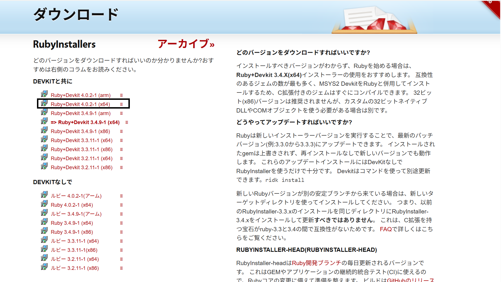
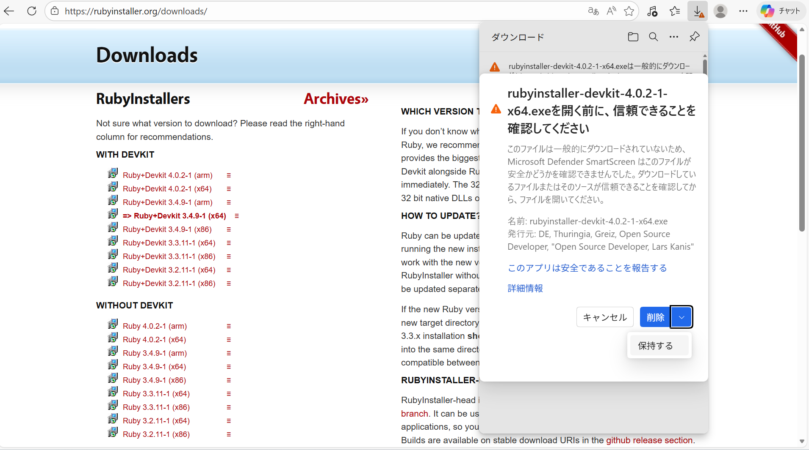

# Ruby RPG 講座 第1回 セットアップ編

中学生向けのやさしい解説で、OpalとViteを使ったRPGづくりを始めます。第1回は、Windows環境での準備とプロジェクトの起動までを行います。

## 今日のゴール

- RubyとNode.jsをWindowsに入れる
- opal-viteの準備ができる
- 開発サーバーを起動できる

## 1. WindowsにRubyを入れる

### 1. Webで「RubyInstaller」を検索して、最新の安定版をダウンロード  
- Ruby+Devkit(バージョン)(×64)というものを選びます。一部のパソコンは(arm)を選ばないといけないため注意してください。



- ダウンロードしたいものをクリックすることでダウンロードできます。

- ダウンロードの際に安全かを確認されることがあります。  
その場合はケバブメニューを押し安全性を報告します。
> ケバブメニューとは  
画面の右上にある三つの点のことです。ちなみに三本線はハンバーガーメニューといいます。  


- ダウンロードのページに戻りケバブメニューから「保持」を選びます。そして下の図の「保持する」を押してください。
- 


- その後は出てきた画面の指示に従う。

### 2. インストーラーを実行してRubyを入れる  
> インストーラーを実行とは  
Windowsなら「エクスプローラー→ダウンロード」、Macなら「Finder→ダウンロード」でダウンロードしたファイルを開くこと。  
  
- インストーラーを実行後下の画面が表示されます。「Install for all users」というほうを選びましょう。


- その後は基本的にオプションの内容を変更せずに進めましょう。  

- Rubyはスタートから開くことができます。  
開くと下の図のような画面が出てくるので左上のものを選び、Enterを押してください。


### 3. 途中でPATHに追加するチェックが出たらオンにする  

インストール確認:

```bash
ruby -v
```

バージョンが表示されればOKです。

## 2. WindowsにNode.jsを入れる

1. Webで「Node.js LTS」を検索して、LTS版をダウンロード
2. インストーラーを実行してNode.jsを入れる

インストール確認:

```bash
node -v
npm -v
```

バージョンが表示されればOKです。

## 3. Gitを入れる

1. Webで「Git for Windows」を検索して、最新の安定版をダウンロード
2. インストーラーを実行してGitを入れる

インストール確認:

```bash
git --version
```

バージョンが表示されればOKです。

## 4. プロジェクトをcloneする

作業したい場所で、次のコマンドを実行します。

```bash
git clone https://github.com/constdrop/opal-vite-rpg.git
```

cloneしたフォルダに移動します。

```bash
cd opal-vite-rpg
```

## 5. step/01 をチェックアウトする

この回の状態に切り替えます。

```bash
git checkout step/01
```

## 6. プロジェクトの準備

この教材は opal-vite を使います。WindowsではBundlerを使わずにgemを直接入れます。

### 6-1. Rubyのgemを入れる

```bash
gem install opal opal-vite
```

### 6-2. Nodeのパッケージを入れる

プロジェクトのフォルダで実行します。

```bash
npm install
```

## 7. 開発サーバーを起動する

```bash
npm run dev
```

表示されたURLをブラウザで開けばOKです。

## 使うファイル

- 設定: [vite.config.ts](vite.config.ts)
- 画面: [index.html](index.html)
- Rubyの読み込み: [app/main_loader.js](app/main_loader.js)

## よくあるつまずき

- `ruby -v` でエラーが出る: RubyのPATHが通っていない可能性があります。インストールをやり直すか、再起動してみてください。
- `npm` が見つからない: Node.jsの再インストールを試してください。
- `git` が見つからない: Git for Windowsのインストールを確認してください。

## 次回予告

次回は、HTMLで画面を作って、Rubyからボタンの動きを作ります。
